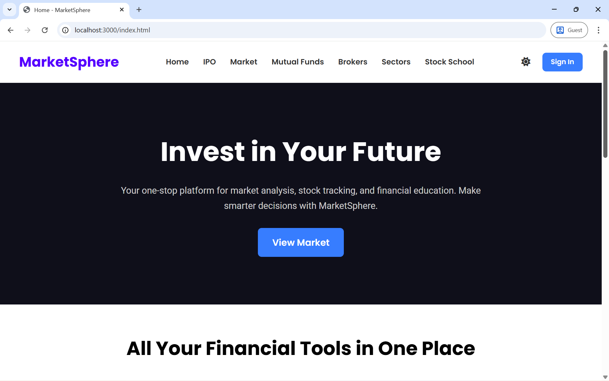
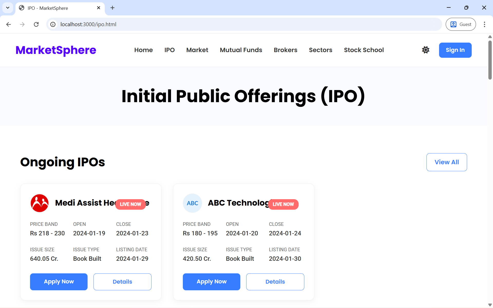
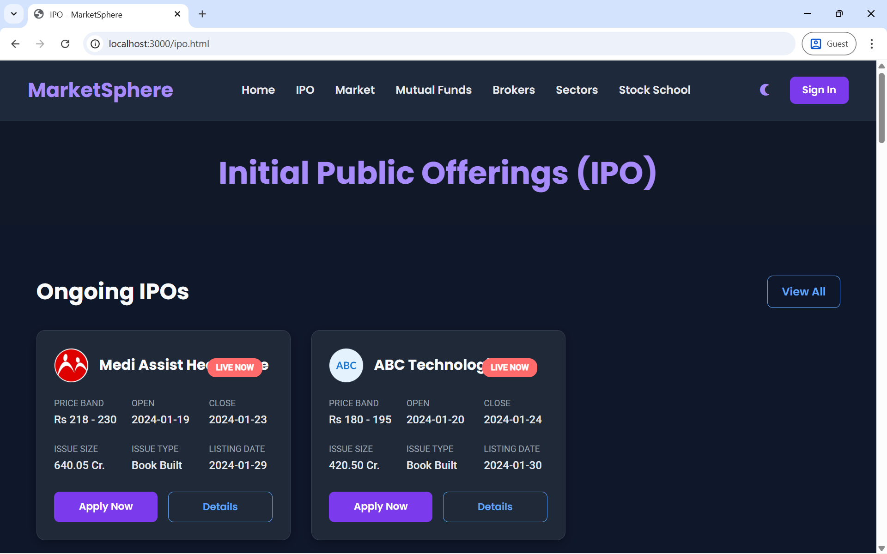
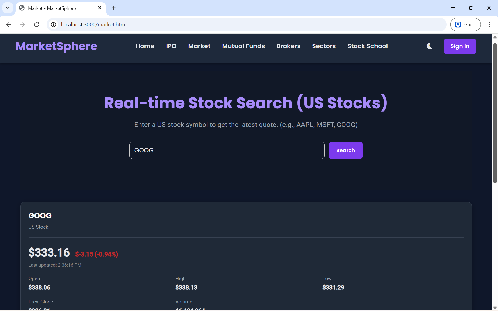
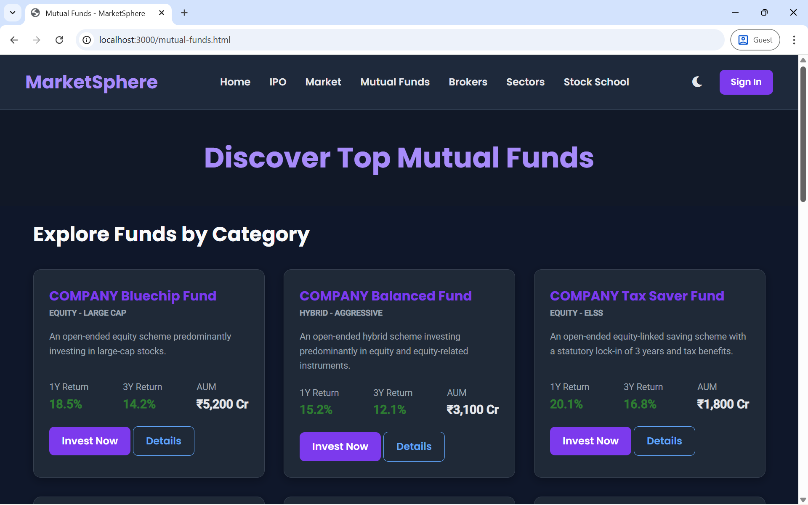
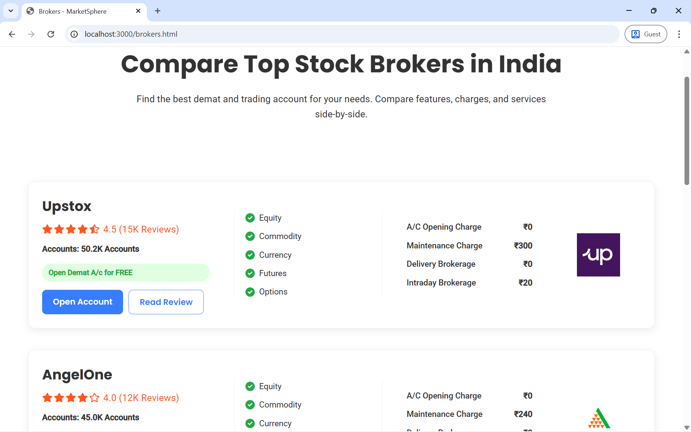
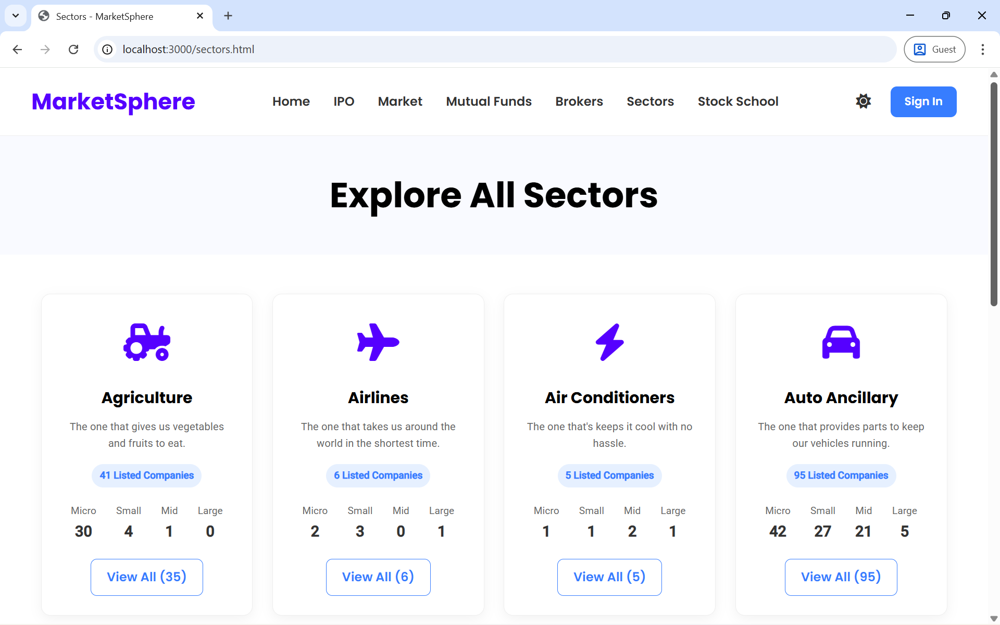
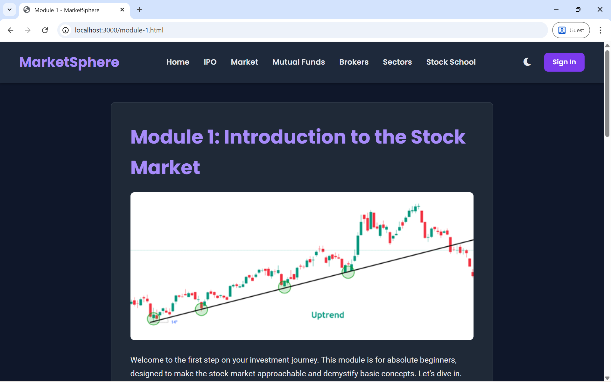
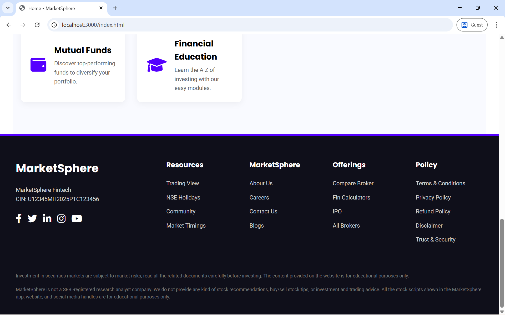

# MarketSphere – The 360° View of Investing

MarketSphere is a full-stack financial web application designed to bridge the gap between **investor education** and **real-time market tracking**. It serves as a dual-purpose platform: a learning hub (**Stock School**) for beginners and a live market dashboard for tracking US stocks, IPOs, brokers, mutual funds, and market sectors.

The application uses a **hybrid data architecture**, combining live APIs, web scraping, and static datasets to deliver accurate, fast, and reliable financial insights.

---

## 📋 Table of Contents
- [Features](#-features)
- [Images] (#-images)
- [Technology Stack](#️-technology-stack)
- [Project Structure](#-project-structure)
- [Quick Start](#-quick-start)
- [Configuration](#️-configuration)
- [Usage](#-usage)
- [API Usage](#-api-usage)
- [Dark Mode](#-dark-mode)
- [Dependencies](#-dependencies)
- [Testing](#-testing)
- [Deployment](#-deployment)
- [Troubleshooting](#-troubleshooting)
- [Security](#-security)
- [Acknowledgments](#-acknowledgments)

---

## ✨ Features

### 📊 Core Features
- **Real-Time Market Dashboard**  
  Live US stock search using the Alpha Vantage API, displaying price, percentage change, volume, and day high/low.

- **Dynamic IPO Tracking**  
  Live scraping of IPO data from InvestorZone, categorized into *Ongoing*, *Upcoming*, and *Listed* IPOs.

- **Broker Comparison Engine**  
  Side-by-side comparison of **17 top Indian brokers** with account opening fees and brokerage rates.

- **Stock School (Education Hub)**  
  Structured curriculum with **4 learning levels** and **16 modules**, covering fundamentals to technical analysis.

- **Sector & Mutual Fund Analysis**  
  Visual sector grid and curated mutual fund listings with return history.

### 🎨 UI / UX Features
- Responsive and **PWA-ready** design
- **Dark / Light Mode** with preference persistence
- Color-coded market indicators and toast notifications
- Infinite scroll for optimized broker listing performance

### ⚙️ Technical Highlights
- **Hybrid Data Architecture** (Live API + Scraping + Static JSON)
- **Server-Side Caching** (TTL: 1 hour) for IPO data
- Centralized backend error handling

---

## 📸 Screenshots

### 🏠 Home Page


### ✨ Feature Overview


### 📢 IPO Tracking



### 📈 Real-Time Stock Search


### 💰 Mutual Funds


### 🏦 Broker Comparison


### 🏭 Sector Analysis


### 🎓 Stock School


### 📘 Stock School – Learning Module


### 🔻 Footer & Compliance


---

## 🛠️ Technology Stack

- **Backend:** Node.js, Express.js  
- **Frontend:** HTML5, CSS3 (Flexbox, Grid), Vanilla JavaScript (ES6+)  
- **APIs & Data:** Alpha Vantage, Cheerio (Web Scraping), JSON  
- **Testing:** Jest, Supertest  
- **Security:** Helmet, CORS, Rate Limiting  

---

## 📁 Project Structure

```text
/ (Project Root)
├── index.js                # Express app entry point & API routes
├── package.json            # Project metadata & dependencies
├── package-lock.json       # Dependency lock file
├── .env                    # Environment variables
├── .gitignore              # Ignored files
│
├── __tests__/              # Integration tests
│   └── integration.test.js
│
├── services/               # Business logic layer
│   └── ipoService.js       # IPO scraping & caching logic
│
├── public/                 # Frontend static assets
│   ├── index.html
│   ├── ipo.html
│   ├── market.html
│   ├── brokers.html
│   ├── mutual-funds.html
│   ├── sectors.html
│   ├── stock-school.html
│   ├── module-1.html
│   ├── signin.html
│   ├── sw.js               # Service Worker
│   ├── style.css
│   │
│   ├── data/               # Static JSON data
│   │   ├── brokers.json
│   │   ├── funds.json
│   │   ├── ipos.json
│   │   ├── sectors.json
│   │   └── stock-school.json
│   │
│   └── js/                 # Client-side scripts
│       ├── home.js
│       ├── ipo.js
│       ├── market.js
│       ├── brokers.js
│       ├── sectors.js
│       ├── mutual-funds.js
│       ├── stock-school.js
│       ├── module-1.js
│       ├── theme-toggle.js
│       └── error-handler.js
│
└── node_modules/
```
---

## 🚀 Quick Start

### Prerequisites
- **Node.js** (v14 or higher)
- **npm** (Node Package Manager)

### Installation
```bash
git clone https://github.com/asarthak2003/marketsphere.git
cd marketsphere
npm install
```
---

## 🎮 Usage

### 👤 For Users
- **Search Stocks:** Use the Market Dashboard to fetch live US stock data
- **Track IPOs:** View ongoing and upcoming IPOs with status badges
- **Compare Brokers:** Compare 17 Indian brokers side-by-side
- **Learn:** Access structured Stock School modules

### 👨‍💻 For Developers

#### Start Development / Production Server
```bash
npm start
```
---

## 🔌 API Usage

The REST API (v1) provides standardized JSON responses.

**Base URL:**  
`http://localhost:3000/api/v1`

| Endpoint | Method | Description | Example |
|--------|--------|-------------|---------|
| `/stock/search` | `GET` | Search US stocks by symbol | `?symbol=AAPL` |
| `/ipos` | `GET` | Get IPOs by status | `?status=ongoing` |
| `/brokers` | `GET` | Get brokers with optional rating filter | `?rating=4.0` |
| `/funds` | `GET` | Get mutual funds by category | `?category=equity` |
| `/stock-school` | `GET` | Get educational modules | N/A |

---

## 🎨 Dark Mode

- **Persistence:** Uses `localStorage` to remember the user's theme preference
- **Implementation:** Managed via `theme-toggle.js`

---

## 📦 Dependencies

- **express** – REST API framework  
- **cheerio** – Server-side HTML parsing for IPO scraping  
- **axios** – HTTP client for external APIs  
- **jest & supertest** – Testing framework  
- **node-cache** – In-memory caching solution  

---

## 🧪 Testing

- Integration testing with **Jest** and **Supertest**
- Mocked Alpha Vantage API using `jest.mock('axios')`
- Coverage includes validation, redirects, and error handling

---

## 🚀 Deployment

- **PWA-ready** architecture
- **Service Worker** caches core assets (CSS, JavaScript, Home page)
- Follows standard **Node.js** deployment practices

---

## 🐛 Troubleshooting

| Error Code | Description |
|-----------|-------------|
| **400 / E001** | Validation failed |
| **404 / E003** | Resource not found |
| **429 / E002** | Rate limit exceeded |
| **504** | External API timeout |

---

## 🔐 Security

- **Helmet** for secure HTTP headers
- **Rate Limiting** (100 requests per minute per IP)
- **CORS** policy enforcement
- Sensitive keys stored securely in `.env`

---

## 🙏 Acknowledgments

- **Alpha Vantage** for providing real-time US stock market data
